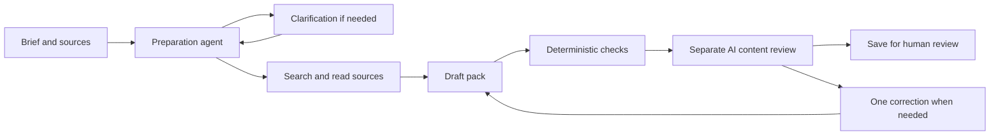

# Workshop Prep Agent

Turn a workshop brief and source materials into an agenda, participant exercise, facilitator notes and source references. Review the pack, revise it with new materials, and download PDF or editable Word documents.

[Explore the demo](https://workshop-prep-agent.vercel.app/example) · [Report a bug](https://github.com/fhajjej-ship-it/workshop-prep-agent/issues) · [Contribute](CONTRIBUTING.md)

## Features

- Upload text-based PDFs, TXT or Markdown, or paste reference material.
- Follow recorded agent actions and answer clarification questions.
- Inspect timing/reference checks and a separate AI-assisted content review.
- Edit the brief and sources, rerun under the same card, and open earlier versions.
- Duplicate, rename or delete workshops you can manage.
- Export PDF, Word, Markdown and JSON.
- Explore a bundled fictional AI pilot workshop without a model call.

This is an independent demonstration. Model-assisted review can miss content errors; inspect the pack before delivering a workshop. No customer outcomes or preparation-time savings are claimed.

## Quick start: no credentials required

Use Node.js 24 LTS and npm. The minimum supported Node version is 22.

```sh
git clone https://github.com/fhajjej-ship-it/workshop-prep-agent.git
cd workshop-prep-agent
npm ci
cp .env.example .env.local
npm run dev
```

Open [http://127.0.0.1:3210](http://127.0.0.1:3210). Defaults use **test mode** and local files. Test mode runs the real tool loop with scripted model decisions and review responses. It verifies workflow mechanics; it does not interpret arbitrary documents or prove live AI quality. Run one Node process per local storage directory.

```sh
npm test
npm run typecheck
npm run build -- --webpack
```

## Agent workflow



Next.js serves the interface and API. The Vercel AI SDK `ToolLoopAgent` chooses server-side tools to clarify, read sources and record a draft. Code checks timing, required fields, references and exact quoted passages. A separate review call checks goal alignment, audience fit, constraints, source grounding and exercise completeness. Persistent review issues or errors stop preparation with the saved draft available.

The model proposes content and actions; application code executes tools, enforces limits and preserves versions. Source text is untrusted input. Tools provide no shell or arbitrary code execution.

| Location | Purpose |
| --- | --- |
| `app/` | Interface, document intake and server API routes |
| `lib/agent.ts` | Agent orchestration, tools and saved state |
| `lib/content-review.ts` | Model-assisted content review |
| `lib/validation.ts` | Deterministic pack checks |
| `lib/store.ts` | Local/Postgres storage with version checks |
| `lib/download*.ts` | Document exports |
| `db/` | Explicit schema and additive migration |
| `tests/` | Scripted and mocked regression coverage |

## Live generation

Set these in your own **untracked** `.env.local`, or your hosting provider's server environment:

```dotenv
WORKSHOP_MODE=live
WORKSHOP_STORE=local
GOOGLE_GENERATIVE_AI_API_KEY=your-own-key
```

The live adapter uses direct Google generation with `LIVE_MODEL` in `lib/config.ts` (`gemini-3.8-flash`), with no Gateway fallback. Your Google account must have access to that model. Live preparations incur provider usage; test mode makes no paid model calls. Never commit environment files or put credentials in `NEXT_PUBLIC_` variables.

Select up to three materials: 20,000 characters each and 40,000 total. Uploads are limited to 3 MB; text-based PDFs may have up to 20 pages. Scanned or password-protected PDFs need extracted or pasted text. Original uploaded files are not retained. Selected text is saved with the workshop and sent to the model during live preparation.

Live work has model-step, tool-call, output and request-time limits. The reviewer shares that budget and can request one correction. These checks do not certify accuracy or teaching quality.

## Postgres and Vercel

Apply `db/schema.sql` explicitly to **your own database**, then set `WORKSHOP_STORE=postgres` and your private `DATABASE_URL`. Migrations are never applied automatically. Changing storage does not migrate existing local records.

For Vercel, import your fork using the Next.js preset and `npm run build -- --webpack`. Configure `WORKSHOP_STORE=postgres`, `DATABASE_URL`, and, for live generation, `WORKSHOP_MODE=live`, `GOOGLE_GENERATIVE_AI_API_KEY` and `WORKSHOP_ALLOW_HOSTED_LIVE=true`. Local file storage is blocked on Vercel because it is not durable. `vercel.json` selects Frankfurt; adapt the region to your own database.

### Shared demo allowance

Set `WORKSHOP_DAILY_GENERATION_LIMIT=20` to allow 20 new live preparations and reruns per UTC day across visitors. `0` pauses new starts; unset disables this allowance. For an existing database, apply `db/daily-generation-allowance.sql` before enabling it.

Accepted runs reserve one slot. Continuations do not count again; failed or deleted runs do not refund slots. Reset is at 00:00 UTC. Refused starts return HTTP 429 with a reset message and `Retry-After`. Saved reads, examples, copies and downloads do not depend on this ledger. This limits starts, **not exact spend**. To disable it, remove the setting and redeploy; retain the ledger.

## Data and access

The library is saved in the visitor's browser. **There is no sign-in or private account access:** anyone with a workshop URL can read its pack and selected source text. Management cookies restrict rename/delete actions; they do not make reads private. Use fictional or non-sensitive materials in a public demo. See [SECURITY.md](SECURITY.md).

Private environment files, run data, uploads, local verification artifacts and Vercel linkage are excluded from this repository. Every installation needs its own credentials and database.

## License

Application source is under the [MIT License](LICENSE). Bundled Noto Sans fonts retain the [SIL Open Font License](assets/fonts/OFL.txt); see their [provenance](assets/fonts/README.md). Dependencies retain their respective licenses.
